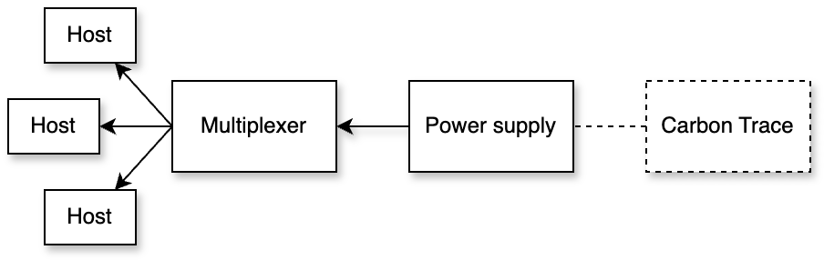

# OpenDC Battery Extension

## Abstract
This project extends the OpenDC simulator by introducing battery support as a secondary power source for data centers. The battery model is designed to optimize energy usage and reduce carbon emissions by allowing charging during periods of low carbon intensity and discharging during periods of high carbon intensity. This extension enables data center simulations to evaluate the impact of battery systems on sustainability and energy efficiency.

## Location of the Battery Extension in OpenDC
The files relating to the simulation of batteries are in `org/opendc/simulator/compute/power`. 

## Features
- Battery model that can be added to the data center topology JSON file.
- Simulates battery charging and discharging based on grid carbon intensity.
- Configurable battery capacity and charging speed.
- Integration within the OpenDC source code without breaking compatibility with previous configurations.
- Power multiplexer enabling switching between grid and battery power.

## Architecture
The architecture of OpenDC was extended to support batteries as a secondary power source. Initially, a single Power supply provided power to a Cluster (consisting of different Hosts) trough a multiplexer. 


**Old Design:**



The updated design introduces a Power adapter after the Multiplexer that dynamically switches between the Power suppy and Battery power based on a Carbon policy. The Carbon policy uses the carbon trace to decide if green energy is available. Currently only a simple Carbon Policy exists, which decides if green energy is available based on a predifined carbon intensity threshold. 

**New Design:**


## Specifying Batteries in JSON Topology Files
Batteries can be specified directly in the JSON topology configuration files. Here is an example in which a battery is added to a cluster:

```json
{
    "clusters": [
        {
            "name": "C01",
            "battery": {
                "capacity": 20000000.0,
                "chargeSpeed": 500.0,
                "carbonThreshold": 125.0
            },
            "hosts": [
                {
                    "name": "H01",
                    "cpu": {
                        "coreCount": 12,
                        "coreSpeed": 3300
                    },
                    "memory": {
                        "memorySize": 140457600000
                    }
                }
            ]
        }
    ]
}
```
A battery is a json object with the following variables: 
- `capacity`: the capacity of the battery in J
- `chargeSpeed`: the charge speed of the battery in W
- `carbonIntensity`: the carbon intensity in CO2/kwh (which is used to decide if green energy is available in the Carbon policy)

## Example Execution
The following describes how to conduct a simple experiment using batteries: 

1. Ensure you have OpenDC with the battery extension installed.
2. Run the simulator using the provided experiment and carbon trace files:

- `resources/optimal_battery_experiment.json`: Contains the data center topology configuration (with a battery) and the workload for the experiment.
- `carbon_traces/correctness_carbon_trace.parquet`: 
 carbon trace that models a simple sinusoidal wave simulating periodic low and high carbon emission phases.

### Output Files:
The results of the experiment can be found in the folder `output`. The folder additionally includes the following files specific to batteries: 
- `battery.parquet`: Contains data related to battery performance.
- `batteryAdapter.parquet`: Contains data related to the powerAdapter managing Battery and Power Source usage.

### Interpreting the results:

The plot below illustrates the experimental results. The battery charges during low-carbon periods, causing a spike in power draw, while carbon emissions flatten when the battery discharges.


## References
For more details, see the paper: [An Extension to OpenDC to Reduce Carbon Emissions in Simulated Data Centers by Implementing Batteries](https://github.com/MaxKampsVu/opendc-battery).
